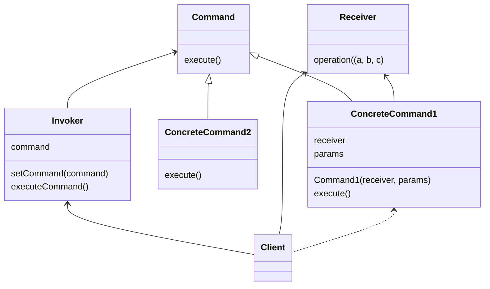

# Command
## TL;DR
- 요청을 객체의 형태로 캡슐화하여 서로 요청이 다른 사용자의 매개변수화, 요청 저장 또는 로깅, 그리고 연산의 취소를 지원하게 만드는 패턴입니다.

## Problem

## Solution

## Structure

## Pros & Cons
- 👍
- 👍
- 👎

## Examples

* [example-1](/examples/Command/python/example-1.py)
