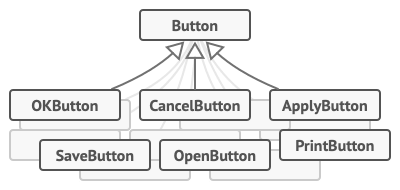
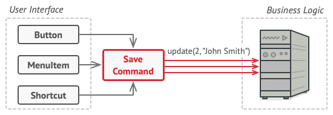
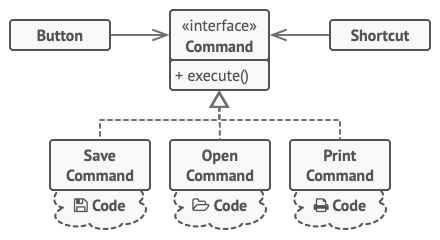
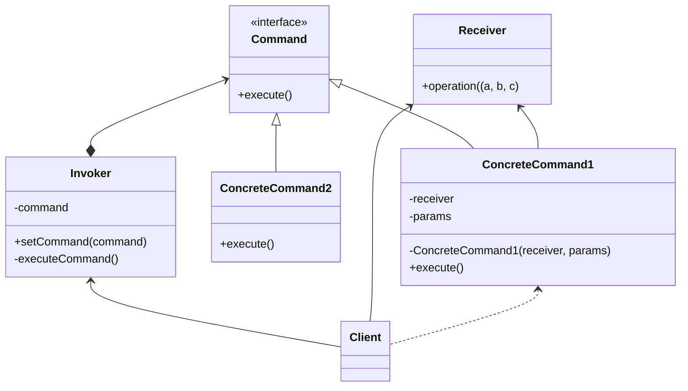

# Command
## TL;DR
- 요청을 객체의 형태로 캡슐화하여 서로 요청이 다른 사용자의 매개변수화, 요청 저장 또는 로깅, 그리고 연산의 취소를 지원하게 만드는 패턴입니다.

## Problem

- 복사, 붙여넣기 등 여러 기능이 있는 텍스트 에디터를 만들려고 합니다.
- 이 에디터에는 각 기능에 대응하는 버튼이 있어야 합니다.
- 각 기능에 대응하고, 버튼 클래스를 상속받는 서브클래스들을 선언합니다. (CopyButton, PasteButton, CutButton, ...) 
- 버튼 클래스의 변경에 큰 리스크가 생기게 됩니다.
- 이 에디터에서 특정 기능을 사용하는 세 가지 방법이 있습니다. 단축키(Shortcut) / 메뉴 클릭(MenuItem) / 버튼 클릭(Button)
- 모두 같은 기능을 하기 떄문에, 모두 중복된 코드를 사용하게 됩니다. 기능에 변화가 있을 시에, 영향이 크게 됩니다.
- GUI의 인터페이스가 비즈니스로직을 직접 호출하게 됩니다.

## Solution

- 각 기능을 커맨드 클래스의 서브클래스로 구현합니다.
- Shortcut, MenuItem, Button 모두 커맨드 클래스를 담는 필드를 갖게 되고, 커맨드 클래스의 인터페이스(execute method)만 의존하게 됩니다.
- GUI 인터페이스들은 커맨드를 트리거 할 뿐, 비즈니스 로직을 몰라도 됩니다.
- 각 기능에 해당하는 버튼의 서브 클래스를 만들 필요 없어집니다. 버튼은 렌더링에서 보여지는 요소에 더 집중하면 됩니다.

## Structure

## Pros & Cons
- 👍 SRP: 동작을 수행하는 클래스와 동작을 유발하는 클래스를 decouple할 수 있다.
- 👍 OCP: 지금 존재하는 Client 코드를 수정하지 않고, 새로운 커맨드를 추가할 수 있다.
- 👍 Undo 또는 Redo를 구현할 수 있다.
- 👍 동작의 실행을 지연시킬 수 있다.
- 👍 여러 커맨드를 하나의 복잡한 커맨드로 조립할 수 있다.
- 👎 코드가 더 복잡해진다.

## Examples

* [example-1](/examples/Command/python/example-1.py)
