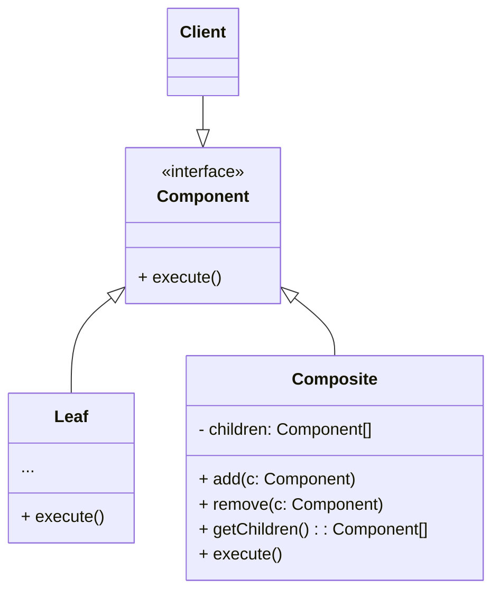

# Composite 
## Intent
**Composite** 는 개체를 트리 구조로 구성한 다음 이런 구조를 개별 개체인 것처럼 작업할 수 있는 구조적 디자인 패턴이다.

## Problem
앱의 핵심 모델이 트리 구조로 표현가능할 때에만 Composite 패턴을 사용하는 것이 의미가 있다.

예를 들어, `상품`과 `상자`라는 두 타입의 개체가 있다고 가정한다. `상자` 에는 여러 `상품`들이 포함될 수 있고, 보다 작은 여러 `상자`들 역시 포함될 수 있다. 해당하는 작은 `상자`들 역시, 여러 `상품`들과 그보다 작은 여러 `상자`가 포함될 수 있다.

이러한 클래스들을 사용해서 주문시스템을 만들기로 결정했다고 가정해보자. 주문은 포장 없는 단순 상품과  상품들이 들어있는 상자 및 기타 상자들이 포함될 수 있다. 이러한 주문의 총 가격을 어떻게 결정할 것인가?

직접적인 방법은 모든 상자를 개봉해서 모든 상품의 가격을 계산하는 방법이다. 이 방법을 현실세계에서는 적용할 수 있지만, 프로그램상에서는 반복문을 도는것처럼 간단하지 않다. 계산중인 상품 및 상자의 클래스, 상자의 중첩 수준과 기타 골치아픈 세부사항을 미리 알아야 한다. 이 모든 것이 직접적인 방법을 너무 어렵거나 심지어 불가능하게 만든다.

## Solution
Composite 패턴은 총 가격 계산 함수가 선언된 인터페이스를 통해 `상품`과 `상자` 를 공통된 방식으로 동작할 수 있도록 제안한다.

어떻게 이것이 가능할까? 상품은 단순하게 해당 상품의 가격을 반환하면 된다. 상자는 상자에 포함된 각 항목을 살펴본 후 가격을 계산하여 상자의 합계 가격을 반환한다. 이들 중 하나가 더 작은 상자일 경우, 해당 상자에 포함된 각 항목을 살펴봐 가격을 계산하고 모든 개별 상품의 가격이 계산될때까지 반복한다. 상자는 포장비용 등을 가격에 추가할 수 있다.

이러한 접근의 가장 큰 혜택은 트리를 구성하는 구체적인 객체 클래스에 대해 신경 쓸 필요가 없다는 것이다. 개체가 단순 상품인지 복잡한 상자인지 알 필요가 없다. 그저 모든 항목을 공통 인터페이스를 통해 똑같이 취급할 수 있다. 함수를 호출하면 개체는 요청을 트리 아래로 전달한다.

## Structure

- **Component** 인터페이스는 트리의 단순 요소와 복잡한 요소 모두에 공통적인 작업을 설명한다
- **Leaf** 는 하위 요소가 없는 트리의 기본 요소이다
- **Container** 는 하위 요소가 있는 요소이다. Container 는 자식의 구체적인 클래스를 알지 못한다. 구성 요소 인터페이스를 통해서만 하위 요소와 작동하게 된다. Container 는 요청을 받으면 작업을 하위 요소에 위임하고 중간 결과를 처리한 다음 최종 결과를 클라이언트에 반환한다.
- `Client` 는 구성 요소 인터페이스를 통해 모든 요소와 작동한다. 결과적으로 클라이언트는 트리의 단순하거나 복잡한 요소와 상관없이 동일한 방식으로 작업할 수 있다.

## Applicability
**트리와 같은 구조를 구현하는 경우 Composite 패턴을 사용할 수 있다.**

Composite 패턴은 단순 Leaf와 복합 컨테이너라는 두 기본 타입을 공통 인터페이스로 제공한다. 컨테이너는 리프들과 다른 컨테이너들로 구성될 수 있다. 이를 통해 나무와 유사한 중첩된 재귀 구조를 구성할 수 있다.

## Pros & Cons
- 👍 복잡한 트리 구조를 보다 편리하게 작업할 수 있다.(다형성과 재귀를 활용)
- 👍 OCP: 트리 개체에서 기존 코드를 변경하지 않고 새로운 요소 타입을 도입할 수 있다.
- 👎 기능이 너무 다른 클래스들에 공통 인터페이스를 제공하는 것이 어려울 수 있다. 특정 시나리오에서는, 구성 요소 인터페이스를 과도하게 일반화하여 이해하기 어렵게 만든다.

## Example

### Tree Price Example
- [Tree price](./example/kotlin/src/main/kotlin/Main.kt)
- [Box](./example/kotlin/src/main/kotlin/Box.kt), [Component](./example/kotlin/src/main/kotlin/Component.kt), [Product](./example/kotlin/src/main/kotlin/Product.kt)
## Reference
[Refactoring.guru](https://refactoring.guru/design-patterns/composite)