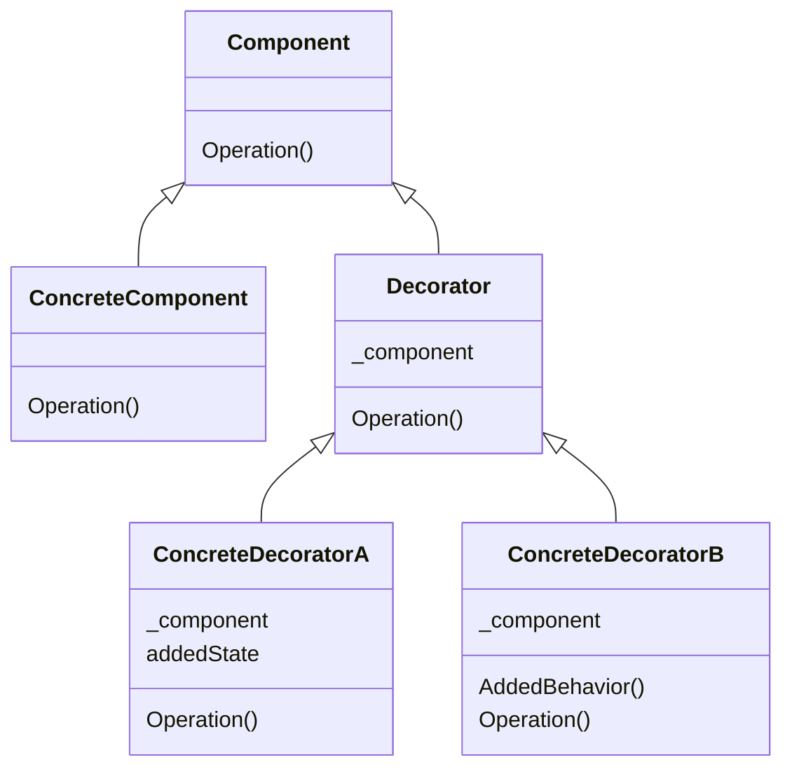

# Factory Method

## TL;DR
데코레이터 패턴은 주어진 상황 및 용도에 따라 어떤 객체에 책임을 덧붙이는 패턴으로, 기능 확장이 필요할 때 서브클래싱 대신 쓸 수 있는 유연한 대안이 될 수 있습니다.

## Problem
input string을 변환시켜주는 TextConverter Interface가 있다. 이 TextConverter의 구현체는 다양하다. 문자를 거꾸로 변환해주는 TextReverseConverter,
문자를 두 번 반복하게 하는 TextTwiceConverter 등. 각 TextConverter가 어떻게 작동하고 있는지 로깅을 하고싶다. 특정 구현체에는 어떤 input이 들어오는지 로깅을 하고싶고,
다른 특정 구현체는 결과가 어떻게 나오는지 로깅을 하고싶다. 하지만 일일이 모든 구현체에 로깅을 반복해서 구현하는 것은 중복이고, OCP를 어기게 된다. 

## Solution  
TextConverter를 상속받는 BaseLogger class를 만들어 TextConverter의 객체에 대한 참조자를 갖게 한다. 
그리고 BaseLogger를 상속받은 InputLogger와 ResultLogger를 만들어, abstract method인 operation을 구현할 때 참조자로 갖고 있는 TextConverter 객체의 operation을 호출한다.
이 때 하고싶은 것들을 Logger들의 operation에 구현하면 된다. FinishLogger는 참조자의 operation 결과를 받아 로깅하고 이를 다시 리턴해주면 된다.
사용자는 원하는 로거를 원하는 TextConverter 구현체에 wrapping 해서 사용하면 된다.  
```python
text_converter = TextReverseConverter()
text_converter = ResultLogger(text_converter)
```
사용자는 기존에 TextConverter를 사용하던 것 처럼 사용할 수 있다.

## Structure


- Component: 동적으로 추가할 서비스를 가질 가능성이 있는 객체들에 대한 인터페이스
- ConcreteComponent: 추가적인 서비스가 실제로 정의되어야 할 필요가 있는 객체
- Decorator: Component 객체에 대한 참조자를 관리하면서 Component에 정의된 인터페이스를 만족하도록 인터페이스를 정의
- ConcreteDecorator: Component에 새롭게 추가할 서비스를 실제로 구현하는 클래스

## Pros & Cons
###  Pros
- 단순한 상속보다 설계의 융통성을 더 많이 증대시킬 수 있습니다.
- 클래스 계통의 상부측 클래스에 많은 기능이 누적되는 상황을 필할 수 있습니다.

### Cons
- 장식자를 사용함으로써 작은 규모의 객체들이 많이 생깁니다.

## Examples

* [example_1](/patterns/Decorator/decorator_example_1.py)
