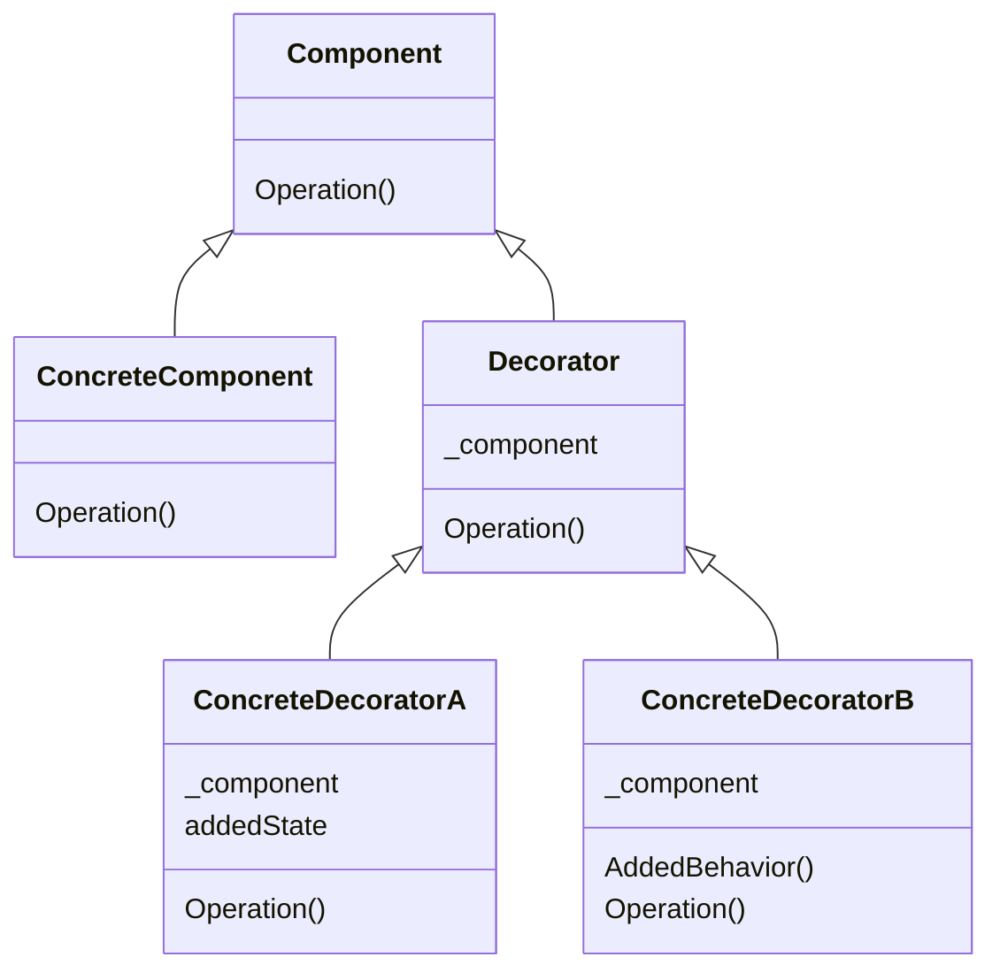

# Factory Method

## TL;DR
데코레이터 패턴은 주어진 상황 및 용도에 따라 어떤 객체에 책임을 덧붙이는 패턴으로, 기능 확장이 필요할 때 서브클래싱 대신 쓸 수 있는 유연한 대안이 될 수 있습니다.

## Problem

## Solution  

## Structure

- Component: 동적으로 추가할 서비스를 가질 가능성이 있는 객체들에 대한 인터페이스
- ConcreteComponent: 추가적인 서비스가 실제로 정의되어야 할 필요가 있는 객체
- Decorator: Component 객체에 대한 참조잦를 관리하면서 Component에 정의된 인터페이스를 만족하도록 인터페이스를 정의
- ConcreteDecorator: Component에 새롭게 추가할 서비스를 실제로 구현하는 클래스

## Pros & Cons
###  Pros
- 단순한 상속보다 설계의 융통성을 더 많이 증대시킬 수 있습니다.
- 클래스 계통의 상부측 클래스에 많은 기능이 누적되는 상황을 필할 수 있습니다.

### Cons
- 장식자를 사용함으로써 작은 규모의 객체들이 많이 생깁니다.

## Examples

* [example_1](/patterns/Decorator/decorator_example_1.py)
