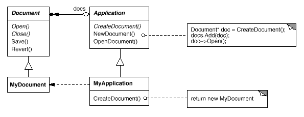
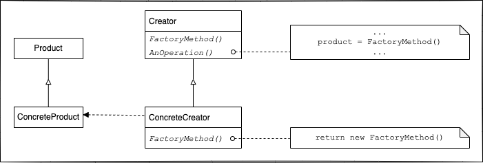

# Factory Method

## TL;DR
생성 패턴 중에 하나.
템플릿 메서드의 생성 패턴 버전이라고 볼 수 있다.
객체를 생성하는 인터페이스는 미리 정의하고, 어떤 클래스의 인스턴스를 만들지는 서브 클래스에서 정한다.

## Problem
다양한 종류의 문서를 표현하기 위하여 Application과 Document이라는 인터페이스를 가지는  있는 응용 프로그램 프레임워크가 있다고 가정해 보자.
Application은 Document를 생성하고 수정하고 관리할 것이다.
이 프로그램을 이용해서 그리기 관련 응용프로그램을 생성한다 하면, DrawApplication과 DrawingDocument를 생성하게 될 것이다.
이렇게 Document의 서브 클래스는 다양하게 만들어질 것이고, Application은 Document의 어떤 서브 클래스의 인스턴스를 만들어야 하는지 미리 알 수가 없다.
Application은 **언제** 문서의 인스턴스를 만들어야 하는지만 알고 있을 뿐, **어떤** 종류의 문서를 생성해야 하는지는 알지 못한다. - GoF의 디자인 패턴

## Solution
  
위의 상황에서 Document의 어떤 서브 클래스를 생성하게 되는지를 Application의 서브 클래스에서 정한다.

## Structure
  
위의 다이어그램이 GOF에 나와있는 팩토리 메서드의 기본 구조이다.
- Product: 생성하고자 하는 객체의 인터페이스
- ConcreteProduct: Product의 구현체, 생성하고자하는 객체
- Creator: Product타입을 반환하는 팩토리 메서드를 선언. 프로덕트에에 관한 코어 비즈니스 로직이 있어야 함.
- ConcreteCreator: 팩토리 메서드를 재정의해서 ConcreteProduct의 인스턴스를 반환.

Creator의 주된 책임은 Product를 만드는 것이 아닌, Product에 관한 비즈니스 로직을 가지고 있는 것이다.

## Pros & Cons
###  Pros
- 동일한 인터페이스에서 새로운 하위 클래스를 만들기 때문에, 기존 소스코드를 변경할 필요 없다 (OCP).
- 객체를 한곳에서 관리할 수 있고, 생성주기를 관리하기 쉬워진다 (SRP).
- 상황에 따라 다른 객체를 반환할 수 있다.

### Cons
- 계속해서 새로운 하위 클래스를 정의하게되어, 불필요하게 많은 클래스를 정의하게 될 수 있다.

## Examples

* [example_1](/examples/Factory_method/factory_method_example_1.py)
* [example_2](/examples/Factory_method/factory_method_example_1.py)

