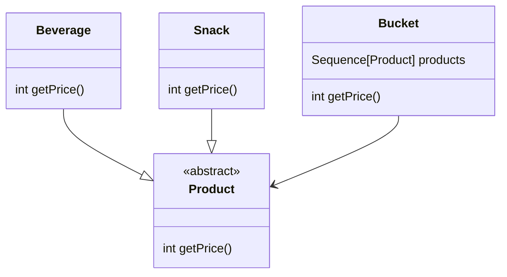
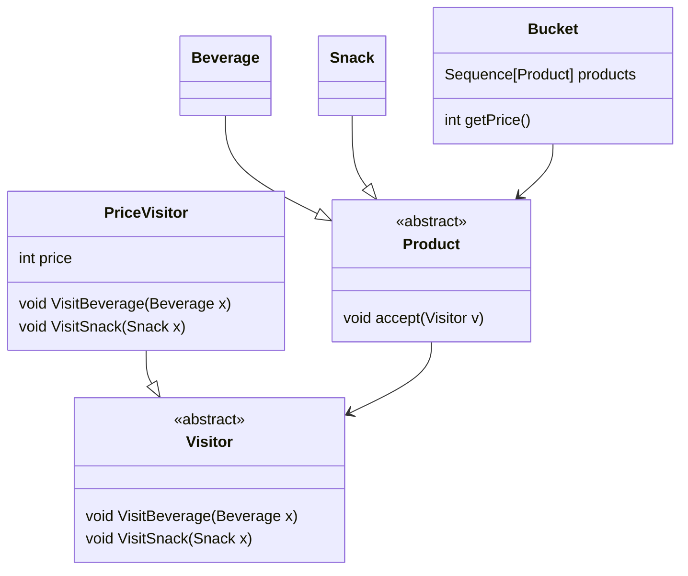
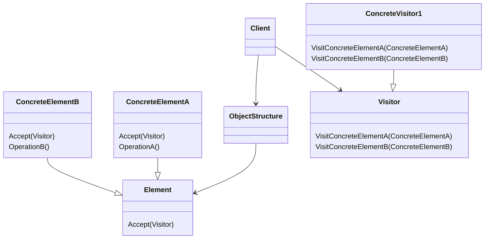

# Visitor

## TL;DR

기존 구조에 대한 수정을 최소화하며 구조 내 각 개체에 접근하는 새로운 기능을 추가하기 용이하게 해주는 패턴.

## Problem

객체들의 관계를 지정한 기존 구조가 있는 상황을 상상해봅시다.
각 객체들은 여러 클래스로 구성되었다고 가정합니다.
이 때 각 객체를 순회해야하는 기능을 추가하고 싶다면 어떻게 해야할까요?

우선 구조를 구성하는 각 객체가 해당 기능을 위해 수행해야할 동작을 포함하는 방법을 떠올려봅시다.
각 객체는 원하는 기능을 수행하기 위한 인터페이스를 노출하고 구조를 순회할 때 각 객체에 대해서 이 인터페이스를 통해 호출하면 되겠습니다.
추가적인 클래스를 생성하지 않고 기존 구조에 기능을 추가하는 방식이므로 단순하게 구현할 수 있을것 같습니다.
하지만 이 방법에는 몇 가지 문제점이 있습니다.
하나는 기존 구조에 수정을 가해 버그를 일으키기 쉽다는 점입니다.
구조를 순회하는 기능은 구조와는 무관합니다.
구조를 이용하긴 하지만 기능의 추가가 구조의 변경을 의미하는 것은 아니므로 구조 자체에 수정을 가하는 것은 적절치 않아보입니다.
다른 하나는 기능이 여러 클래스에 흩어진다는 점입니다.
각 객체가 기능에 대한 구현을 담당할 것이므로 기능 하나가 각 객체에 흩어진 상태로 구현됩니다.
기능에 수정이 필요할 때 수정하기도 쉽지 않고 유지보수하기에 좋은 선택은 아닐 것으로 예상할 수 있습니다.

예로 마트에서 장바구니에 들어있는 상품들의 가격을 계산하는 어플리케이션을 상상해봅시다.
(편의상 각 분류의 모든 상품이 가격이 동일하다고 가정합시다.)
각 객체가 수행해야할 동작을 포함하는 방식으로 구현한다면 아래와 같이 구현하는 것을 상상해볼 수 있겠습니다.



여기서 가격 계산을 요청할 점원은 Bucket의 getPrice를 호출하게 됩니다.
Bucket은 그에 속한 각 Product의 getPrice를 호출해 총 가격을 산출합니다.
이렇게 구현했을 때, 위에서 지적한 것과 같이 Product의 구조에 무관한 기능인 getPrice를 Product에서 구현하고 있는 것이 어색해보입니다.
이 방식을 채택했을 때 물품 분류마다 따로 할인율이 지정되는 할인가를 가져온다면 어떻게 구현해야할까요?
각 클래스에 할인율을 추가하고 새로운 인터페이스를 추가하면서 점점 클래스가 담당해야할 기능이 늘어나는 것은 물론이고, 흩어져있을 여러 클래스에 기능을 계속 추가해줘야하는 문제점이 있습니다.  

## Solution

이를 해결하기 위해 Visitor 패턴에서는 기능을 Visitor로 분리합니다.
위에서 구조 상의 각 클래스가 기능을 구현했던 것과는 다르게, 각 객체는 함수 호출 시 Visitor를 인자로 받고 Visitor에 자신을 인자로 넘겨줍니다.
사실 Visitor를 받는 함수를 구현하기 위해 여전히 기존 구조를 수정해야하긴 하지만, 위에서 기능이 추가될 때마다 각 클래스가 가져가는 코드가 비례했던 것과는 다르게 한 번 추가하면 이후에 수정할 일이 거의 없게 됩니다.
Visitor는 각 클래스에 대해 기능을 어떻게 구현할지를 정의합니다.
각 Visitor가 각 클래스에 대한 기능을 정의하므로 위의 구현과는 다르게 기능 구현이 한 곳으로 모이게 됩니다.

예시를 Visitor 패턴으로 재구성하면 아래와 같이 구성할 수 있습니다.



여기서 Product를 상속하는 클래스들은 Visitor를 호출할 뿐 기능에 대한 정의를 하지 않습니다.
Visitor는 각 클래스에 대해서 어떤 동작을 할지를 정의합니다.

### Double Dispatch

이렇게 구현하면 어떨까요?

```
class Calculator
    func getPrice(p: Product):
        return 1000
    func getPrice(b: Beverage):
        return 1500
    func getPrice(s: Snack):
        return 2000

class App
    func getPrice(p: Product):
        Calculator c = new Calculator()
        print(c.getPrice(p))
```

이 구현에서 Dynamic binding을 지원하지 않는 언어에서는 항상 Product의 가격을 얻게됩니다.
이는 이미 기능이 구현되어있는 Beverage, Snack이 아닌 다른 타입이 들어왔을 때 컴파일러의 동작을 예측할 수 없어 Product로 가정하기 때문으로, 컴파일러의 동작을 따릅니다. [1]

Double dispatch는 한 요청에 대해 두 개의 수신자에 의존해 실행되는 방식입니다.
여기서 두 개의 수신자란 Visitor와 Visitor를 호출하는 클래스를 의미합니다.

TODO


## Structure




## Pros and Cons

- TODO

## Examples


[1] https://refactoring.guru/design-patterns/visitor-double-dispatch
