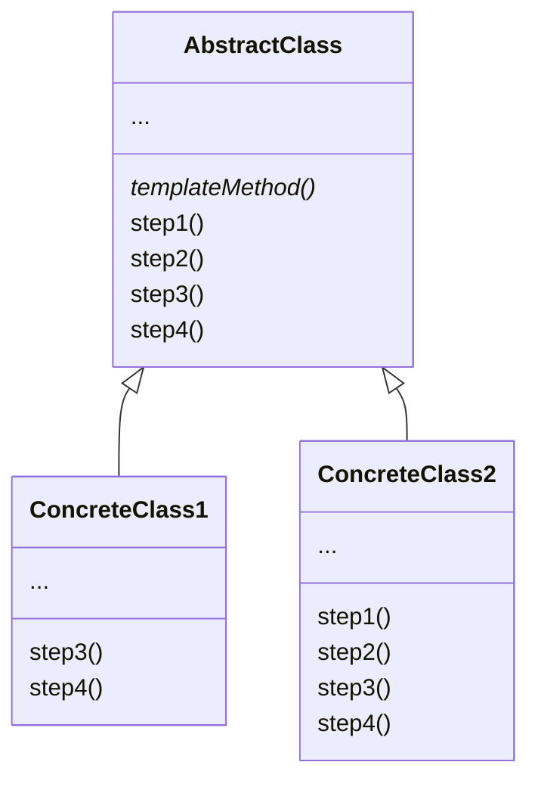

# Template Method

## TL;DR
상위 클래스에서 알고리즘의 뼈대를 구성해 두고, 하위 클래스에서 각각의 단계를 override할 수 있도록 구성한 패턴이다.

## Problem
회사의 문서를 분석하는 데이터 마이닝 어플리케이션을 만들고 있다고 가정해 보자. 사용자들은 다양한 형식(PDF, DOC, CSV)의 문서를 생성할 것이고, 이 문서들로부터 의미있는 데이터를 일관된 형식으로 추출해 내야 한다.

어플리케이션의 첫 번 째 버전은 DOC 파일에 대해서만 동작하도록 구성해볼 수 있을 것이다. 다음 버전에서는 CSV 파일을 지원하게 되었고. 몇 달 후에는 PDF 파일도 지원하도록 변경되었다. 이 과정에서 데이터 마이닝이 구현된 각 class에는 많은 중복 코드가 들어가게 되었다.

각 class에서 서로 다른 데이터 형식을 다루는 부분 이외에 데이터 프로세싱이나 분석을 위한 코드는 거의 똑같기 때문에 알고리즘 구조를 해치지 않으면서 중복된 부분을 제거할 수 있다면 좋을 것이다.

이 class들을 사용하는 클라이언트 코드에도 각각의 데이터 형식에 대한 서로 다른 class를 사용하기 위하여 많은 조건문이 포함되어 있을 것이다. 만약 3개의 class 모두가 공통된 인터페이스를 가진다면 클라이언트에서는 다형성을 이용하여 이러한 조건문을 없앨 수 있다.

## Solution
Template method 패턴은 전체 알고리즘을 일련의 단계로 나누고, 각 단계를 method로 구성한다. 해당 method들은 하나의 template method 안에서 호출되며 전체 알고리즘을 표현하게 된다.
각각의 단계는 abtract method일 수도 있고, 기본 구현을 가질 수도 있다. 

알고리즘을 사용하기 위해서는 하위 클래스에서 abstract 단계를 전부 구현해야 하고, 선택적으로 기본 구현을 가진 단계도 변경할 수 있다.

## Structure


```python
def templateMethod():
    if step2():
        step3()
    else:
        step4()
```

## Pros & Cons
###  Pros
- 큰 알고리즘의 일부 단계만 override하여 변경을 최소화할 수 있다.
- 반복되는 로직은 상위 클래스에 구현하여 중복 코드를 줄일 수 있다.

### Cons
- Template method가 제공하는 skeleton이 일부 client에게는 기능 구현을 위해 충분하지 않을 수 있다.
- Template method에 많은 단계가 포함될 수록 관리하기가 어려워진다.
